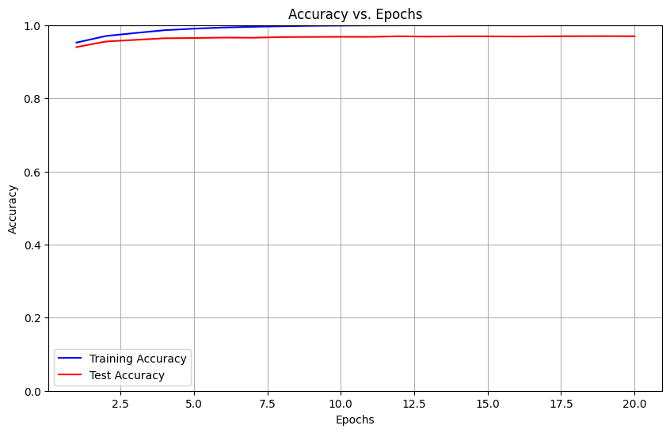

# ANN-AICE403: Multilayer Perceptron Neural Network Implementation

## Project Overview
This repository contains a comprehensive implementation of a Multilayer Perceptron (MLP) Neural Network built from scratch for the AICE403 course. The implementation focuses on fundamental concepts of neural networks with a clean, modular architecture and detailed documentation.

## Features
- **Custom Neural Network Implementation**: Built from first principles without relying on high-level deep learning frameworks
- **Modular Architecture**: Well-structured code with separate functions for:
  - Data preparation and preprocessing
  - Weight initialization (He, Xavier, random)
  - Various activation functions (Sigmoid, ReLU, Softmax)
  - Forward and backward propagation
  - Cost functions and optimization algorithms
- **Model Evaluation**: Comprehensive tools for model evaluation and visualization
- **MNIST Classification**: Example application for handwritten digit recognition

## Core Components

### Data Handling
- Functions for loading and preprocessing MNIST dataset
- Data normalization and standardization
- Train-test splitting
- One-hot encoding for categorical data

### Neural Network Architecture
- Flexible layer dimensions
- Support for different activation functions:
  - Sigmoid: For binary classification problems
  - ReLU: For hidden layers to handle vanishing gradient problem
  - Softmax: For multi-class classification output

### Training Algorithms
- Mini-batch Stochastic Gradient Descent
- L2 Regularization for preventing overfitting
- Customizable learning rates, batch sizes, and epochs

### Visualization Tools
- Loss and accuracy plotting during training
- Prediction visualization
- Confusion matrix for model evaluation
- Detailed graphical analysis of model performance

## Function Explanations

### Data Processing Functions

#### `load_mnist()`
Loads the MNIST dataset from the OpenML repository. The function:
- Uses `fetch_openml` to download the MNIST dataset
- Converts the data to numpy arrays
- Applies normalization to scale pixel values
- Optionally reshapes the data to 28×28×1 format

#### `preprocess_data(X, y, test_size=0.2, random_state=42)`
Prepares data for neural network training by:
- Splitting data into training and test sets using the specified ratio
- Reshaping input data to 2D format if necessary
- Applying standardization to feature values
- Returns processed training and test datasets

#### `one_hot_encode(y, num_classes=None)`
Transforms integer class labels into one-hot encoded vectors:
- Creates a binary matrix where each row corresponds to a sample
- Sets a single 1 value in each row at the position corresponding to the class label
- All other values in the row are 0
- Essential for multi-class classification problems

## Model Class Overview
The core of the implementation is the `MLP` class, which provides:

```python
class MLP:
    """
    Multi-Layer Perceptron Neural Network implementation from scratch
    """
    
    def __init__(self, layer_dims, hidden_activations="relu", output_activation="softmax",
                initialization="he", learning_rate=0.01, num_epochs=100, batch_size=64,
                lambd=0, verbose=True, plot_interval=5)
    
    def fit(self, X, y, X_test=None, y_test=None)
    
    def predict(self, X)
    
    def evaluate(self, X, y)
    
    def plot_cost(self)
    
    def plot_accuracy(self)
```

### Neural Network Functions

#### Initialization Functions

##### `initialize_parameters(layer_dims, initialization_method="he")`
Creates and initializes the weight matrices and bias vectors for all layers:
- Supports multiple initialization techniques: He (default), Xavier, and random
- He initialization: Optimized for ReLU activation functions
- Xavier initialization: Better for sigmoid and tanh activations
- Returns a dictionary containing all weight matrices and bias vectors

##### `xavier_init(in_dim, out_dim)`
Implements Xavier/Glorot initialization for weights:
- Scales random values by sqrt(1/in_dim) for better gradient flow in training
- Particularly effective for sigmoid and tanh activation functions
- Creates properly scaled weight matrix and zero-initialized bias vector

#### Activation Functions

##### `sigmoid(Z)`
Implements the sigmoid activation function:
- Transforms input values to range [0,1]
- Formula: σ(z) = 1/(1+e^(-z))
- Useful for binary classification and gates in more complex architectures
- Returns both the activation values and a cache for backpropagation

##### `sigmoid_backward(dA, cache)`
Computes gradients for the sigmoid activation during backpropagation:
- Uses the property that sigmoid'(z) = sigmoid(z) * (1 - sigmoid(z))
- Essential for training neural networks with sigmoid activations

##### `relu(Z)`
Implements the Rectified Linear Unit activation:
- Returns max(0,z) for each input value
- Creates sparse activations (many zeros)
- Helps alleviate vanishing gradient problems
- Returns both activation values and cache for backpropagation

##### `relu_backward(dA, cache)`
Computes gradients for ReLU activation during backpropagation:
- Gradient is 1 for inputs > 0, and 0 otherwise
- Efficiently handles large networks due to computational simplicity

##### `softmax(Z)`
Implements the softmax activation function:
- Transforms inputs into a probability distribution
- Formula: softmax(z_i) = e^z_i / Σ(e^z_j)
- Uses numerical stability techniques by subtracting max value
- Primarily used in output layer for multi-class classification

##### `softmax_backward(dA, cache)`
Computes gradients for softmax activation:
- Simplified implementation that works with cross-entropy loss
- Returns the incoming gradient directly (typical simplification)

#### Forward Propagation Functions

##### `linear_forward(A_prev, W, b)`
Computes the linear part of forward propagation for a single layer:
- Calculates Z = WA + b where W is the weight matrix, A is the input, and b is the bias
- Stores the inputs in a cache for backpropagation
- Essential building block for neural network layers

##### `linear_activation_forward(A_prev, W, b, activation)`
Combines linear forward propagation with an activation function:
- First applies linear_forward to compute Z
- Then applies the specified activation function (sigmoid, relu, or softmax)
- Returns both the activation output and caches for backpropagation
- Handles different activation types to support various network architectures

##### `L_model_forward(X, parameters, hidden_activations, output_activation)`
Implements forward propagation for the entire L-layer neural network:
- Processes input data through all layers of the network
- Applies specified activation functions for hidden and output layers
- Collects all cache values for later backpropagation
- Returns the final output and complete cache list

#### Cost Functions

##### `compute_cost(AL, Y, parameters=None, lambd=0)`
Calculates the cross-entropy cost function:
- Measures difference between predicted probabilities (AL) and true labels (Y)
- Optionally includes L2 regularization to prevent overfitting
- Returns a scalar cost value that the training process aims to minimize
- Lower cost indicates better model performance

##### `mse_cost(AL, Y)`
Implements Mean Squared Error cost function:
- Calculates average of squared differences between predictions and actual values
- Alternative cost function useful for regression problems
- Formula: MSE = (1/2m) * Σ(y_pred - y_true)²
- Provides a different error metric depending on the problem domain

#### Backward Propagation Functions

##### `linear_backward(dZ, cache, lambd=0)`
Computes the gradients for the linear part of a layer:
- Calculates gradients of the cost with respect to W, b, and A_prev
- Implements L2 regularization when lambda > 0
- Uses the chain rule from calculus to propagate gradients backward
- Returns gradients needed to update parameters

##### `linear_activation_backward(dA, cache, activation, lambd=0)`
Combines activation function gradient with linear backward propagation:
- First computes gradient through the activation function (sigmoid_backward, relu_backward, etc.)
- Then passes this gradient to linear_backward
- Handles different activation functions with appropriate backward calculations
- Returns gradients with respect to previous layer activation, weights, and bias

##### `L_model_backward(AL, Y, caches, hidden_activations, output_activation, lambd=0)`
Implements backward propagation for the entire L-layer network:
- Starts with the gradient calculation at the output layer
- Iteratively computes gradients for each layer moving backward
- Applies appropriate activation gradients based on layer type
- Returns a dictionary containing all gradients for parameter updates

#### Parameter Update Functions

##### `update_parameters(parameters, grads, learning_rate)`
Updates the network parameters using gradient descent:
- Takes current parameters and calculated gradients
- Applies the learning rate to control update step size
- Updates all weights and biases in the direction of decreasing cost
- Returns the updated parameters for the next iteration

##### `mini_batch_sgd(X, Y, parameters, layer_dims, learning_rate, num_epochs, batch_size, etc.)`
Implements mini-batch stochastic gradient descent optimization:
- Processes data in small batches rather than all at once
- Shuffles data for each epoch to improve convergence
- For each mini-batch: performs forward prop, computes cost, backward prop, and updates parameters
- Tracks and returns costs during training for monitoring convergence

#### MLP Class Methods

##### `MLP.__init__(self, layer_dims, hidden_activations, output_activation, etc.)`
Constructor method that initializes the MLP model:
- Sets up network architecture with specified layer dimensions
- Configures hyperparameters (learning rate, batch size, etc.)
- Defines activation functions for hidden and output layers
- Prepares for training by initializing parameters and tracking variables

##### `MLP.fit(self, X, y, X_test=None, y_test=None)`
Trains the neural network on provided data:
- Prepares data shapes and formats for training
- Initializes network parameters if not done already
- Implements the training loop with mini-batch SGD
- Tracks and displays loss and accuracy metrics during training
- Returns the trained model

##### `MLP.predict(self, X)`
Generates predictions using the trained model:
- Formats input data appropriately
- Performs forward propagation through the network
- Converts output activations to class predictions
- Returns predictions in the appropriate format

##### `MLP.evaluate(self, X, y)`
Calculates model performance metrics:
- Generates predictions for provided input data
- Compares predictions to ground truth labels
- Computes accuracy score
- Handles various input formats (one-hot encoded or class indices)

##### `MLP.plot_cost(self)`
Visualizes the training loss over epochs:
- Creates a graph showing cost vs. epochs
- Helps assess convergence and training dynamics
- Useful for diagnosing training issues (e.g., learning rate too high/low)

##### `MLP.plot_accuracy(self)`
Visualizes training and test accuracy over epochs:
- Creates a comparative plot of training vs. test accuracy
- Helps identify overfitting (high training but low test accuracy)
- Shows the model's learning progress visually

## Visualization and Graphical Analysis

The implementation includes comprehensive visualization tools to help understand model performance and training dynamics:

### Training Process Visualization

#### Loss Curve
The `plot_cost()` method generates a plot showing how the loss function value changes over epochs:
- Helps monitor convergence during training
- Visualizes if and when the model reaches a plateau
- Can identify issues like oscillation or slow convergence
- Example from the MNIST training:


#### Accuracy Curves
The `plot_accuracy()` method generates plots for both training and test accuracy over epochs:
- Shows how model performance improves during training
- Compares training and test accuracy to detect overfitting
- Helps determine optimal training duration
- Example from the MNIST training:



### Model Evaluation Visualizations

#### Prediction Visualization
The `visualize_predictions()` function displays sample predictions on test data:
- Shows input images alongside true and predicted labels
- Particularly useful for image classification tasks
- Helps identify patterns in misclassifications
- Example of MNIST prediction visualization:


#### Confusion Matrix
The `create_confusion_matrix()` function generates a heatmap showing classification results:
- Visualizes which classes get confused with each other
- Darker cells indicate more predictions in that category
- Diagonal cells represent correct classifications
- Example confusion matrix:


### Benefits of Visualization

1. **Debugging**: Quickly identify issues in model training
2. **Performance Analysis**: Understand model strengths and weaknesses
3. **Tuning**: Guide hyperparameter adjustments
4. **Explainability**: Communicate model behavior to others
5. **Learning**: Visualize theoretical concepts in action

## Theoretical Concepts
This project also includes theoretical explanations of key neural network concepts:

1. **Representation Learning**: How neural networks learn meaningful data representations
2. **Deep Learning Fundamentals**: The meaning and applications of deep learning
3. **Neural Network Applications**: Common use cases and domains
4. **Weights and Parameters**: How they're initialized and tuned during training
5. **Loss Functions and Optimizers**: Their role and relationship in model training
6. **Representation/Encoding**: How data is transformed and represented within neural networks

### Utility and Visualization Functions

##### `visualize_predictions(model, X, y, num_samples=5)`
Creates visual representations of model predictions:
- Selects random samples from the dataset
- Displays the original input images
- Shows both true labels and model predictions
- Helps visually assess model performance
- Particularly useful for image classification tasks like MNIST

##### `create_confusion_matrix(model, X, y, max_classes=10)`
Generates a confusion matrix to evaluate classification performance:
- Uses sklearn's confusion_matrix function
- Creates a heatmap visualization with seaborn
- Shows which classes get confused with each other
- Provides more detailed performance analysis than accuracy alone
- Supports limiting the display to a maximum number of classes for readability

##### `run_tests(model=None)`
Comprehensive test suite for validating the implementation:
- Tests individual components (normalization, initialization, activation functions, etc.)
- Verifies end-to-end model functionality
- Provides detailed feedback on which components pass or fail tests
- Includes optional testing of model performance on MNIST subset
- Useful for ensuring correctness and debugging issues

##### `main()`
Main function that orchestrates the entire workflow:
- Loads and preprocesses the MNIST dataset
- Defines and configures the neural network architecture
- Trains the model and tracks performance
- Evaluates on test data and reports metrics
- Visualizes predictions and confusion matrix
- Runs validation tests on the implementation
- Serves as a complete example of using the framework

## Usage Example

```python
# Load and preprocess MNIST data
X, y = load_mnist()
X_train, X_test, y_train, y_test = preprocess_data(X, y)

# Define network architecture
input_size = X_train.shape[1]  # 784 for MNIST
hidden_layers = [256, 256]
output_size = 10  # 10 classes for MNIST
layer_dims = [input_size] + hidden_layers + [output_size]

# Create and train the model
model = MLP(
    layer_dims=layer_dims,
    hidden_activations="relu",
    output_activation="softmax",
    initialization="he",
    learning_rate=0.05,
    num_epochs=20,
    batch_size=128,
    lambd=0.001
)

# Train the model
y_train_onehot = one_hot_encode(y_train, 10)
model.fit(X_train.T, y_train_onehot.T, X_test, y_test)

# Evaluate the model
train_accuracy = model.evaluate(X_train, y_train)
test_accuracy = model.evaluate(X_test, y_test)

# Visualize results
visualize_predictions(model, X_test, y_test)
create_confusion_matrix(model, X_test, y_test)
```

## Testing and Verification
The implementation includes comprehensive testing functions to verify various components:
- Activation functions
- Cost functions
- Forward and backward propagation
- Full model performance on MNIST dataset

## Running the Project
To run the complete project:

```python
if __name__ == "__main__":
    main()
```

## Requirements
- NumPy
- Matplotlib
- Scikit-learn (for data handling and evaluation metrics)
- Seaborn (for confusion matrix visualization)